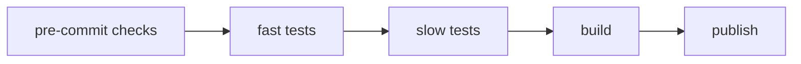

All of this was great - we refactored our code, wrote some tests, built and published our package, and made some documentation. But what if the project grows in size, or we have to make continuous changes to the software? Can we automate this process?

## GitHub Workflows
The real power of this section comes from utilizing GitHub workflows.

## Precommits
We can auto format all of our files using 4 packages:

- `black` - [Black](https://black.readthedocs.io/en/stable/) enforces code formatting compliant with [PEP 8](https://peps.python.org/pep-0008/) such as line lengths, indentation, blank lines, etc.
- `flake8` - [Flake8](https://flake8.pycqa.org/en/latest/index.html#) checks for style and syntax errors. Usually used in conjunction with `black`.
- `mypy` - [mypy](https://mypy.readthedocs.io/en/stable/) checks for typing errors, will help find potential problems with passing incorrect types, when type hints have been added in accordance with [PEP 484](https://peps.python.org/pep-0484/).
- `isort` - [isort](https://pycqa.github.io/isort/) sorts your imports appropriately.

In order to ensure code consistency, we will run these checks every time we make a commit. This can be annoying, but it is for our own good!

We first add pre-commit to the dev group:
```bash
poetry add --dev pre-commit
```

Add a file in the root directory called `.pre-commit-config.yaml` and add the following content:

```
repos:
- repo: https://github.com/psf/black
  rev: 24.3.0
  hooks:
  - id: black
- repo: https://github.com/PyCQA/flake8
  rev: 7.0.0
  hooks:
  - id: flake8
- repo: https://github.com/pre-commit/mirrors-mypy
  rev: v1.9.0
  hooks:
  - id: mypy
- repo: https://github.com/PyCQA/isort
  rev: 5.13.2
  hooks:
  - id: isort
```

We also add the following to the `pyproject.toml` file:
```
[tool.black]
line-length = 88
```

Create another file called `.flake8` and add
```
[flake8]
max-line-length = 88
```
I know...it's annoying that we can't do this in the toml file.

Now try and stage and commit your changes. You should get a pop up saying some stuff has failed. `black` will have altered some files, and `flake8` is probably complaining about something. Make the changes and restage and recommit. Hopefully you should see:

```
black....................................................................Passed
flake8...................................................................Passed
mypy.....................................................................Passed
isort....................................................................Passed
```

## Automated Testing

!!! note 
    Why don't we just include testing int he pre-commit hook? Pre-commit hooks are supposed to be fast and local. Automated tests and other automated workflows are more comprehensive, and can take longer to run. Separating them out allows you to separate interests and keep small changes fast.

Now we are making some progress, but we should try to automate testing everytime we push changes to the dev branch.

First create a new file in the root
```bash
touch .github/workflows/tests.yml
```

Now add the following text:
```
name: Run Tests
# Whenever code is pushed to dev and when a PR is merged from dev to main
# run all the jobs
on:
  push:
    branches: [dev]
  pull_request:
    branches: [main]
    types: [closed]

jobs:
  # Just have one job called "tests"
  tests:
    runs-on: ubuntu-latest

    steps:
    - uses: actions/checkout@v4
    - name: Set up Python
      uses: actions/setup-python@v5
      with:
        python-version: "3.10"
    - name: Install dependencies
      run: |
        python -m pip install --upgrade pip
        pipx install poetry
        poetry install
    - name: Run tests
      run: |
        poetry run python -m unittest discover tests/
```

Let's break something, to make sure this works. In your `test_target_to_diagnosis()` method, swap the 1 and the 0 around...

```
Run poetry run python -m unittest discover tests/
.F
======================================================================
FAIL: test_target_to_diagnosis (test_CancerModel.TestCancerModel)
----------------------------------------------------------------------
Traceback (most recent call last):
  File "/home/runner/work/cancer-prediction/cancer-prediction/tests/test_CancerModel.py", line 22, in test_target_to_diagnosis
    self.assertEqual(diagnosis, "Malignant")
AssertionError: 'Benign' != 'Malignant'
- Benign
+ Malignant


----------------------------------------------------------------------
Ran 2 tests in 0.000s

FAILED (failures=1)
Error: Process completed with exit code 1.
```

Great!, It's working! Since we have gone to the effort to use these tools, we should include them in the `README.md`. You can add the following:

[](https://pycqa.github.io/isort/)
[](https://github.com/psf/black)
[](https://mypy-lang.org/)


While, we're at it, we will also run the pre-commit on a push action. We have three

<details>
<summary>Click to reveal the full workflow</summary>

```
name: Run Tests

on:
  push:
    branches: [dev]
  pull_request:
    branches: [main]
    types: [closed]

jobs:
  pre-commit:
    runs-on: ubuntu-latest

    steps:
    - uses: actions/checkout@v4
    - name: Install poetry
      run: pipx install poetry
    - uses: actions/setup-python@v5
      with:
        python-version: '3.10'
        cache: 'poetry'
    - run: poetry install
    - name: Run pre-commit checks
      run: |
        poetry run pre-commit run --all-files

  tests:
    needs: pre-commit
    runs-on: ubuntu-latest

    steps:
    - uses: actions/checkout@v4
    - name: Install poetry
      run: pipx install poetry
    - uses: actions/setup-python@v5
      with:
        python-version: '3.10'
        cache: 'poetry'
    - run: poetry install
    - name: Run tests
      run: |
        poetry run python -m unittest discover tests/

```
</details>


## Publishing
We now essentially have a package ready to distribute.

### Pull Requests
First we will make a pull request to merge changes from dev to main. Head over to the repo and click on Pull requests. Submit a new PR. Make sure the base is main, and the compare is dev. Then create pull request

### Publish to PyPy
We will only publish to TestPyPi. First set up an account with [TestPyPi](https://test.pypi.org/). You will need to enable 2FA with an authenticator app.

Now run

```
poetry build
```

This will create two packages in thr `dist/` folder:

```
cancer_prediction-0.1.0-py3-none-any.whl
cancer_prediction-0.1.0.tar.gz
```

This are your distributable files. By default they will be included in the `.gitignore`, but you can remove them if you want people to be able to download development versions of your software.

Run
```
poetry config repositories.test-pypi https://test.pypi.org/legacy/
```

Create a new API Token in PyPi, and then run
```
poetry config pypi-token.test-pypi <your-token>
```

Finally, run
```
poetry publish -r test-pypi
```
You can now look at your TestPyPi projects and it should be there! To check it has all worked, we deactivate the current environment and create a new one:
```bash
python3.10 -m venv venvTest
. venvTest/bin/activate
```

You can verify the path of the python version you are using by running
```bash
which python
```
and this should return something like:\
 `/workspaces/cancer-prediction/venvTest/bin/python`

We install the dependencies in the new environment using
```bash
python -m pip install -r requirements.txt
```
We have to do this, because if you try to install a package from TestPyPi which has dendencies that are NOT hosted on TestPyPi, the installation will fail.

Now install your new package, and try out the `cancer-prediction run` command.

Boom. Done. The process for publishing to PyPi is pretty similar.

## Automate the publishing process
OK so we're not done yet. Now we will create a workflow that will publish a new version to TestPyPi when a PR is merged with `main`. This is a little more complicated. How can we provide maximum protection? We will have two workflows: one for `dev`, one for `main`. The breakdown might look like this:

__Workflow 1 - push to `dev`__:


__Workflow 2 - Merge PR to `main`__:


So you do the fast stuff on your push to `dev` and you do all of that, plus any additional testing before pushing to production. You can add an additional step for tests when a PR is submitted, but this will do for our cases. We don't have any additional slow tests either.

One handing thing you can do in GitHub is enforce "Rulesets". One Ruleset that we can create is protecting the main branch from idiocy - a PR is only allowed to be merged if all status checks are passed.

Now we will create a workflow that will build and publish only when a PR is merged. First we will make sure that our repo has access to the necessary permissions. To do this, go to Settings -> Actions -> General, and allow Read and write permissions. When a new package is published, we can now add a badge!

[](https://GitHub.com/rkdan/cancer-prediction/releases)


# Publish documentation
We can publish documentation within the github ecosystem using mkdocs. First install mkdocs to the development group:
```bash
poetry add --dev mkdocs
```

Now initialize the documentation:
```bash
python -m mkdocs new .
```

This should create 
```
├─ docs/
│  └─ index.md
└─ mkdocs.yml
```
