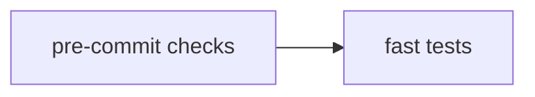
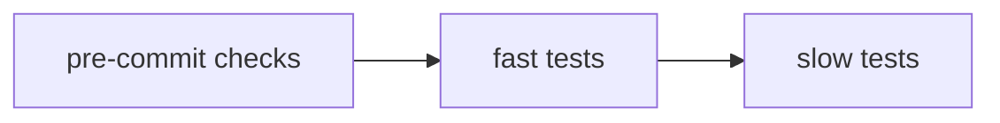
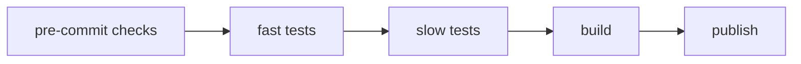

Finally, we will automate the publishing of our package to PyPI and the release of the documentation.

## Publishing

### Pull requests
When do we want to publish our package and documentation? We don't want to publish when we push changes to `dev`, because there might be some experimental changes that we've made that could break our package. Instead we should restrict publishing only when there are pushes made to `main`. However, we don't just want to push changes to main directly.

Head over to the repo and submit a pull request. It should look something like this:


You should make sure that the `compare` branch is `dev` and the `base` branch is `main`. There are no conflicts so I can merge these branches without any issues. If there are conflicts you must manually go through them and decide whether you want to keep the `base` changes or the `compare` changes. Hit Create pull request and give it a title and description, and hit Create pull request again. You should come through to a page that looks somewhat like the image below.


Notice that there are some checks happening. We want to avoid hitting that Merge pull request button as long as those checks have not passed. We can actually enforce this, but for now we can just manually make sure that the checks have passed. When the PR is merged, a new release will be made. So how do we do this?

To demonstrate the process, create a new workflow called `build-and-publish.yml`. It looks like this:

```yaml
name: Build and Publish

on:
  pull_request:
    branches:
      - main
  push:
    branches:
      - main

jobs:
  pre-commit:
    runs-on: ubuntu-latest

    steps:
      - uses: actions/checkout@v4
      - name: Install poetry
        run: pipx install poetry
      - uses: actions/setup-python@v5
        with:
          python-version: '3.10'
          cache: 'poetry'
      - run: poetry install
      - name: Run pre-commit checks
        run: |
          poetry run pre-commit run --all-files

  tests:
    needs: pre-commit
    runs-on: ubuntu-latest

    steps:
      - uses: actions/checkout@v4
      - name: Install poetry
        run: pipx install poetry
      - uses: actions/setup-python@v5
        with:
          python-version: '3.10'
          cache: 'poetry'
      - run: poetry install
      - name: Run tests
        run: |
          poetry run python -m unittest discover tests/

  release:
    needs: tests
    if: github.event_name == 'push' && github.ref == 'refs/heads/main'
    runs-on: ubuntu-latest

    steps:
      - uses: actions/checkout@v4
        with:
          fetch-depth: 0
          token: ${{ secrets.GITHUB_TOKEN }}
      - name: Install Poetry
        run: pipx install poetry
      - name: Set up Python
        uses: actions/setup-python@v5
        with:
          python-version: '3.10'
          cache: 'poetry'
      - name: Install dependencies
        run: poetry install
      - name: Bump version
        run: |
          git config user.name github-actions
          git config user.email github-actions@github.com
          
          # Get the commit message
          commit_message=$(git log -1 --pretty=%B)
          
          # Determine the version bump type based on the commit message
          if echo "$commit_message" | grep -q -i -E '^(break|major)\b'; then
            version_type="major"
          elif echo "$commit_message" | grep -q -i -E '^(feat|minor)\b'; then
            version_type="minor"
          else
            version_type="patch"
          fi
          
          # Bump the version using Poetry
          poetry version $version_type
          version=$(poetry version -s)
          
          git add pyproject.toml
          git commit -m "Bump version to $version"
          git push
      - name: Build package
        run: poetry build
      - name: Get version from pyproject.toml
        id: get_version
        run: |
          version=$(poetry version -s)
          echo "::set-output name=version::$version"
      - name: Create Release
        id: create_release
        uses: actions/create-release@v1
        env:
          GITHUB_TOKEN: ${{ secrets.GITHUB_TOKEN }}
        with:
          tag_name: v${{ steps.get_version.outputs.version }}
          release_name: Release ${{ steps.get_version.outputs.version }}
          body: Release ${{ steps.get_version.outputs.version }}
      - name: Publish to TestPyPI
        env:
          POETRY_REPOSITORIES_TEST_PYPI_URL: https://test.pypi.org/legacy/
        run: |
          poetry config repositories.test-pypi https://test.pypi.org/legacy/
          poetry publish -r test-pypi -u __token__ -p ${{ secrets.TEST_PYPI_API_TOKEN }}
```

This is quite a bit longer than the one we did for only testing! Notice we have three jobs: the pre-commit (again), the tests (again) and the release. Why do we do all these checks? This seems insane. We'll talk about this later. For now, let's have a look at what is going on.

### Run conditions
```yaml
name: Build and Publish

on:
  pull_request:
    branches:
      - main
  push:
    branches:
      - main
```
As before, we name the workflow. Now though, we run on two occasions: when a PR is submitted targeting `main`, and when a push is made to `main`

### The Jobs
The first two jobs are the same. The next job `#!yaml release` requires the first two jobs to pass, and in addition we have this line:
```yaml
if: github.event_name == 'push' && github.ref == 'refs/heads/main'
```

This is saying that the `#!yaml release` job will only run when there is a push to main. In other words, when someone submits a PR only, this section of code will NOT run.

The next interesting part is
```yaml
- name: Bump version
    run: |
        git config user.name github-actions
        git config user.email github-actions@github.com
        
        # Get the commit message
        commit_message=$(git log -1 --pretty=%B)
        
        # Determine the version bump type based on the commit message
        if echo "$commit_message" | grep -q -i -E '^(break|major)\b'; then
        version_type="major"
        elif echo "$commit_message" | grep -q -i -E '^(feat|minor)\b'; then
        version_type="minor"
        else
        version_type="patch"
        fi
        
        # Bump the version using Poetry
        poetry version $version_type
        version=$(poetry version -s)
        
        git add pyproject.toml
        git commit -m "Bump version to $version"
        git push
```

This part is responsible for bumping the version number in the `pyproject.toml` file. First we set some conditions on our commit messages. I can have three different types of commit message:

```bash
patch: <commit message here>
minor: <commit message here> # (1)!
major: <commit message here> # (2)!
```

1. You can also substitute `minor` for `feat`
2. You can also substitute `major` for `break`

The type of changes you make will depend on which number in the version gets changed according to standard semantic versioning rules. The idea of semantic versioning is to use 3-part version numbers, *major.minor.patch*, where the project author increments:

- major when they make incompatible API changes,
- minor when they add functionality in a backwards-compatible manner, and
- patch, when they make backwards-compatible bug fixes.

We then allow the GitHub bot to alter the version in the `pyproject.toml` file, and commit and push the changes. Obviously this push does not trigger the workflow again, otherwise that would result in an endless loop. In order for this to work, you need to give the GitHub Bot permission to write to your repo. Head to Settings -> Actions -> General. Look for Workflow permissions, and click Read and write permissions, and save.

The final section builds the package and releases it to GitHub and to Test PyPI. In order for this to work, you have to give GitHub your API key. Head to the repo Settings -> Secrets and variables -> Actions. Add a new repository secret and call it `TEST_PYPI_API_TOKEN`.

## Why so many checks?
For the most part, all of these checks are for demonstration purposes and to increase exposure to different basic workflows. But what if you are the maintainer of a piece of software that has two or three other PhD students working on it, and you like total control? You might have three rounds of checks.

__Check 1 - push to `dev`__:


__Check 2 - PR to `main`__:


__Check 3 - PR merge to `main`__:


Your PhD students will run the pre-commit and do some quick test checks locally, and then their code will get automatically tested when they do a push to their development branch, which will then do the same thing, perhaps on a variety of operating systems or with python versions. They will then submit a PR, whereupon the same tests occur, and perhaps some additional slower more comprehensive tests. You will then see the outcome of these tests and decide to merge the changes to main. All tests are conducted again, and the software is built and released.

For a single person working on a project, and for most projects, this is overkill, and you can get away with significantly less. However in some key pieces of software with many people working on it, or where certain regulatory issues are present, having so many redundant checks provides multiple layers of protection from idiocy. If your project is open source, then you need strict control over who can contribute.

Typically you can now just delete the `dev` branch. When you want to make more changes, just create a new branch from main, make your changes, then merge back to main and release directly from main. Or you can keep your `dev` branch, but when you want to work on it again, you must remember to update your dev branch. You can do this with
```
git checkout dev
git merge origin/main
```

### Different approaches to CI/CD
There are two main schools of development on git: Git Flow, and trunk-based development.

#### Git Flow
In Git Flow you have two long-running branches `main` and `dev`. Workers will usually branch off of `dev`, make some feature change, then submit a PR. The PR is accepted (or not) and merged to `dev`. When we are happy, we create a release branch, do some tests, and then merge this branch into `main` and tag it with a release. This style is very suitable to open-source projects, where you can't trust random people trying to make changes to your code.

#### Trunk
In Trunk-based development, you work from a single `main` branch. Usually you work from it directly, and make short changes, and make small `feature` branches. Development is fast and continuous. When you are happy, you create a separate `release` branch which is pushed to PyPI (or wherever). This is a great option for small, speedy projects.
